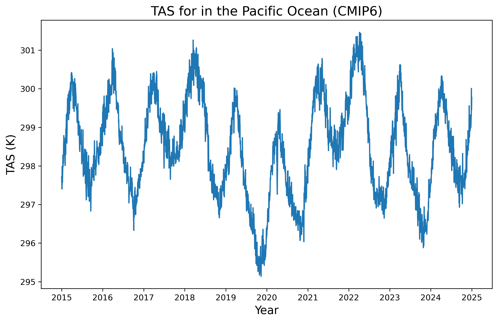

# **This notebook will go over how to read netCDF files**

## **Reading in netCDF files:**
* We will use xarray (a Python package) to read data stored in Network Common Data Format(netCDF)

```python 
import xarray as xr 
import numpy as np

data_ncdf = xr.open_dataset('file_path4.cdf') # use xarray to open the data file
```

* To view the contents of the data, which is stored as an xarray.Dataset object, you can use '.head()'syntax or 'print()' command.
```python
data_ncdf.head()
```
```python
print(data_ncdf)
```

* We can also use the 'netCDF4' library to read and manipulate data stored in NetCDF format.

```python
import netCDF4 as nc

nc_file = nc.Dataset('file_path5.nc', 'r') # opening netCDF file, read-only
```

* You can acess and work with data in the file using the attributes 'variables' and 'dimensions'.

Print a list of the variables in the file using
```python
print(nc_file.variables) 
```

Print the dimensions in the file
```python
print(nc_file.dimensions) 
```

Access a specific variable by name
```python
print(nc_file.variables['variable_name']) 
```

## NetCDF: Dimensions and Variables

**Dimensions** define the sizes of the data arrays along specific axes in the file, providing shape and size information for variables.

* Typically used to define coordinate variables. Ex: a dimension 'time' with size 365 means there are 365 data values along the time axis in the corresponding variable
* Usefulness of dimensions:

1.   Data Extraction: knowing the structure of the data allows you to extract specific subsets of the data (such as data within a certain time frame, region, or depth level, which are determined by the dimensions)
2.   Data Analysis and Visualization: dimensions provide context for data analysis and for the creation of meaningful plots, maps, and other visuals
3.   Metadata Interpretation: associated meta data (units, description, etc.) is helpful when interpreting and using data correctly
4.   Data Integration: understanding dimensions is critical when integrating/merging data from different files or sources


**Variables** hold the actual data values as multidimensional arrays associated with dimensions.

* They are defined using one or more dimensions that specify the size of each dimension of the variable.
* Ex: a variable 'temperature' with dimensions time, lat, and lon

```
temperature(time, lat, lon)
```

## Next: using the files we opened using python and its packages to create figures

Decide which data to use: 
* from NCAR CESM2 (CMIP6 20th century experiments (1850-2014) with CAM6, interactive land (CLM5), coupled ocean (POP2) with biogeochemistry (MARBL), interactive sea ice (CICE5.1), and non-evolving land ice (CISM2.1)) _(.nc)_

import necessary libraries (or use conda on terminal)
```python
import xarray as xr
import numpy as np
import pandas as pd
import matplotlib.pyplot as plt
```

### netCDF from CMIP6 CESM2 future scenario SSP2-4.5
* downloading it: things to consider
- model version, scenario, time period, variable to look at, variant id
> * variant id 
> - CMIP6 netCDF file metadata includes the variant-id global attribute (w/ format r1i1p1f1), where the numbers are indices for particular configurations of:
r: realisation (i.e. ensemble member)
i: initialisation method
p: physics
f: forcing 
https://ukesm.ac.uk/cmip6/variant-id/ (source for above...note that org. is based in the UK)


```python
# open netCDF file using xarray
import xarray as xr
data = xr.open_dataset('Downloads/tas_day_CESM2-WACCM_ssp245_r1i1p1f1_gn_20150101-20241231.nc')

# viewing the data
print(data)
```

    /Users/pluto/anaconda3/lib/python3.11/site-packages/xarray/conventions.py:431: SerializationWarning: variable 'tas' has multiple fill values {1e+20, 1e+20}, decoding all values to NaN.
      new_vars[k] = decode_cf_variable(


    <xarray.Dataset>
    Dimensions:    (time: 3650, lat: 192, lon: 288, nbnd: 2)
    Coordinates:
      * lat        (lat) float64 -90.0 -89.06 -88.12 -87.17 ... 88.12 89.06 90.0
      * lon        (lon) float64 0.0 1.25 2.5 3.75 5.0 ... 355.0 356.2 357.5 358.8
      * time       (time) object 2015-01-01 00:00:00 ... 2024-12-31 00:00:00
    Dimensions without coordinates: nbnd
    Data variables:
        tas        (time, lat, lon) float32 ...
        time_bnds  (time, nbnd) object ...
        lat_bnds   (lat, nbnd) float64 ...
        lon_bnds   (lon, nbnd) float64 ...
    Attributes: (12/45)
        Conventions:            CF-1.7 CMIP-6.2
        activity_id:            ScenarioMIP
        branch_method:          standard
        branch_time_in_child:   735110.0
        branch_time_in_parent:  735110.0
        case_id:                966
        ...                     ...
        sub_experiment_id:      none
        table_id:               day
        tracking_id:            hdl:21.14100/40f02150-9a95-47bf-ae97-ef2585e44bcc
        variable_id:            tas
        variant_info:           CMIP6 CESM2 future scenario SSP2-4.5, years 2015-...
        variant_label:          r1i1p1f1


```python
type(data)

# call for the variables being stored in the file 
print(data.variables.keys())
```

    KeysView(Frozen({'tas': <xarray.Variable (time: 3650, lat: 192, lon: 288)>
    [201830400 values with dtype=float32]
    Attributes: (12/19)
        cell_measures:  area: areacella
        cell_methods:   area: time: mean
        comment:        TREFHT
        description:    near-surface (usually, 2 meter) air temperature
        frequency:      day
        id:             tas
        ...             ...
        time_label:     time-mean
        time_title:     Temporal mean
        title:          Near-Surface Air Temperature
        type:           real
        units:          K
        variable_id:    tas, 'lat': <xarray.IndexVariable 'lat' (lat: 192)>
    array([-90.      , -89.057592, -88.115183, -87.172775, -86.230366, -85.287958,
           -84.34555 , -83.403141, -82.460733, -81.518325, -80.575916, -79.633508,
           -78.691099, -77.748691, -76.806283, -75.863874, -74.921466, -73.979058,
           -73.036649, -72.094241, -71.151832, -70.209424, -69.267016, -68.324607,
           -67.382199, -66.439791, -65.497382, -64.554974, -63.612565, -62.670157,
           -61.727749, -60.78534 , -59.842932, -58.900524, -57.958115, -57.015707,
           -56.073298, -55.13089 , -54.188482, -53.246073, -52.303665, -51.361257,
           -50.418848, -49.47644 , -48.534031, -47.591623, -46.649215, -45.706806,
           -44.764398, -43.82199 , -42.879581, -41.937173, -40.994764, -40.052356,
           -39.109948, -38.167539, -37.225131, -36.282723, -35.340314, -34.397906,
           -33.455497, -32.513089, -31.570681, -30.628272, -29.685864, -28.743455,
           -27.801047, -26.858639, -25.91623 , -24.973822, -24.031414, -23.089005,
           -22.146597, -21.204188, -20.26178 , -19.319372, -18.376963, -17.434555,
           -16.492147, -15.549738, -14.60733 , -13.664921, -12.722513, -11.780105,
           -10.837696,  -9.895288,  -8.95288 ,  -8.010471,  -7.068063,  -6.125654,
            -5.183246,  -4.240838,  -3.298429,  -2.356021,  -1.413613,  -0.471204,
             0.471204,   1.413613,   2.356021,   3.298429,   4.240838,   5.183246,
             6.125654,   7.068063,   8.010471,   8.95288 ,   9.895288,  10.837696,
            11.780105,  12.722513,  13.664921,  14.60733 ,  15.549738,  16.492147,
            17.434555,  18.376963,  19.319372,  20.26178 ,  21.204188,  22.146597,
            23.089005,  24.031414,  24.973822,  25.91623 ,  26.858639,  27.801047,
            28.743455,  29.685864,  30.628272,  31.570681,  32.513089,  33.455497,
            34.397906,  35.340314,  36.282723,  37.225131,  38.167539,  39.109948,
            40.052356,  40.994764,  41.937173,  42.879581,  43.82199 ,  44.764398,
            45.706806,  46.649215,  47.591623,  48.534031,  49.47644 ,  50.418848,
            51.361257,  52.303665,  53.246073,  54.188482,  55.13089 ,  56.073298,
            57.015707,  57.958115,  58.900524,  59.842932,  60.78534 ,  61.727749,
            62.670157,  63.612565,  64.554974,  65.497382,  66.439791,  67.382199,
            68.324607,  69.267016,  70.209424,  71.151832,  72.094241,  73.036649,
            73.979058,  74.921466,  75.863874,  76.806283,  77.748691,  78.691099,
            79.633508,  80.575916,  81.518325,  82.460733,  83.403141,  84.34555 ,
            85.287958,  86.230366,  87.172775,  88.115183,  89.057592,  90.      ])
    Attributes:
        axis:           Y
        bounds:         lat_bnds
        standard_name:  latitude
        title:          Latitude
        type:           double
        units:          degrees_north
        valid_max:      90.0
        valid_min:      -90.0, 'lon': <xarray.IndexVariable 'lon' (lon: 288)>
    array([  0.  ,   1.25,   2.5 , ..., 356.25, 357.5 , 358.75])
    Attributes:
        axis:           X
        bounds:         lon_bnds
        standard_name:  longitude
        title:          Longitude
        type:           double
        units:          degrees_east
        valid_max:      360.0
        valid_min:      0.0, 'time': <xarray.IndexVariable 'time' (time: 3650)>
    array([cftime.DatetimeNoLeap(2015, 1, 1, 0, 0, 0, 0, has_year_zero=True),
           cftime.DatetimeNoLeap(2015, 1, 2, 0, 0, 0, 0, has_year_zero=True),
           cftime.DatetimeNoLeap(2015, 1, 3, 0, 0, 0, 0, has_year_zero=True), ...,
           cftime.DatetimeNoLeap(2024, 12, 29, 0, 0, 0, 0, has_year_zero=True),
           cftime.DatetimeNoLeap(2024, 12, 30, 0, 0, 0, 0, has_year_zero=True),
           cftime.DatetimeNoLeap(2024, 12, 31, 0, 0, 0, 0, has_year_zero=True)],
          dtype=object)
    Attributes:
        axis:           T
        bounds:         time_bnds
        standard_name:  time
        title:          time
        type:           double, 'time_bnds': <xarray.Variable (time: 3650, nbnd: 2)>
    [7300 values with dtype=object], 'lat_bnds': <xarray.Variable (lat: 192, nbnd: 2)>
    [384 values with dtype=float64]
    Attributes:
        units:    degrees_north, 'lon_bnds': <xarray.Variable (lon: 288, nbnd: 2)>
    [576 values with dtype=float64]
    Attributes:
        units:    degrees_east}))


```python
# explore each of the variables individually

lon = data.variables['lon']
print(lon)

# this will show what the units are for the variable, as well as other useful information such as the the standard name

# there are 288 horizontal lines
```

    <xarray.IndexVariable 'lon' (lon: 288)>
    array([  0.  ,   1.25,   2.5 , ..., 356.25, 357.5 , 358.75])
    Attributes:
        axis:           X
        bounds:         lon_bnds
        standard_name:  longitude
        title:          Longitude
        type:           double
        units:          degrees_east
        valid_max:      360.0
        valid_min:      0.0


```python
lat = data.variables['lat']
print(lat)
# there are 192 verticle lines 
```

    <xarray.IndexVariable 'lat' (lat: 192)>
    array([-90.      , -89.057592, -88.115183, -87.172775, -86.230366, -85.287958,
           -84.34555 , -83.403141, -82.460733, -81.518325, -80.575916, -79.633508,
           -78.691099, -77.748691, -76.806283, -75.863874, -74.921466, -73.979058,
           -73.036649, -72.094241, -71.151832, -70.209424, -69.267016, -68.324607,
           -67.382199, -66.439791, -65.497382, -64.554974, -63.612565, -62.670157,
           -61.727749, -60.78534 , -59.842932, -58.900524, -57.958115, -57.015707,
           -56.073298, -55.13089 , -54.188482, -53.246073, -52.303665, -51.361257,
           -50.418848, -49.47644 , -48.534031, -47.591623, -46.649215, -45.706806,
           -44.764398, -43.82199 , -42.879581, -41.937173, -40.994764, -40.052356,
           -39.109948, -38.167539, -37.225131, -36.282723, -35.340314, -34.397906,
           -33.455497, -32.513089, -31.570681, -30.628272, -29.685864, -28.743455,
           -27.801047, -26.858639, -25.91623 , -24.973822, -24.031414, -23.089005,
           -22.146597, -21.204188, -20.26178 , -19.319372, -18.376963, -17.434555,
           -16.492147, -15.549738, -14.60733 , -13.664921, -12.722513, -11.780105,
           -10.837696,  -9.895288,  -8.95288 ,  -8.010471,  -7.068063,  -6.125654,
            -5.183246,  -4.240838,  -3.298429,  -2.356021,  -1.413613,  -0.471204,
             0.471204,   1.413613,   2.356021,   3.298429,   4.240838,   5.183246,
             6.125654,   7.068063,   8.010471,   8.95288 ,   9.895288,  10.837696,
            11.780105,  12.722513,  13.664921,  14.60733 ,  15.549738,  16.492147,
            17.434555,  18.376963,  19.319372,  20.26178 ,  21.204188,  22.146597,
            23.089005,  24.031414,  24.973822,  25.91623 ,  26.858639,  27.801047,
            28.743455,  29.685864,  30.628272,  31.570681,  32.513089,  33.455497,
            34.397906,  35.340314,  36.282723,  37.225131,  38.167539,  39.109948,
            40.052356,  40.994764,  41.937173,  42.879581,  43.82199 ,  44.764398,
            45.706806,  46.649215,  47.591623,  48.534031,  49.47644 ,  50.418848,
            51.361257,  52.303665,  53.246073,  54.188482,  55.13089 ,  56.073298,
            57.015707,  57.958115,  58.900524,  59.842932,  60.78534 ,  61.727749,
            62.670157,  63.612565,  64.554974,  65.497382,  66.439791,  67.382199,
            68.324607,  69.267016,  70.209424,  71.151832,  72.094241,  73.036649,
            73.979058,  74.921466,  75.863874,  76.806283,  77.748691,  78.691099,
            79.633508,  80.575916,  81.518325,  82.460733,  83.403141,  84.34555 ,
            85.287958,  86.230366,  87.172775,  88.115183,  89.057592,  90.      ])
    Attributes:
        axis:           Y
        bounds:         lat_bnds
        standard_name:  latitude
        title:          Latitude
        type:           double
        units:          degrees_north
        valid_max:      90.0
        valid_min:      -90.0


```python
time = data.variables['time']
print(time)

# we can see that first date and the last date that is included 
# notice that 'time' is an object here 
```

    <xarray.IndexVariable 'time' (time: 3650)>
    array([cftime.DatetimeNoLeap(2015, 1, 1, 0, 0, 0, 0, has_year_zero=True),
           cftime.DatetimeNoLeap(2015, 1, 2, 0, 0, 0, 0, has_year_zero=True),
           cftime.DatetimeNoLeap(2015, 1, 3, 0, 0, 0, 0, has_year_zero=True), ...,
           cftime.DatetimeNoLeap(2024, 12, 29, 0, 0, 0, 0, has_year_zero=True),
           cftime.DatetimeNoLeap(2024, 12, 30, 0, 0, 0, 0, has_year_zero=True),
           cftime.DatetimeNoLeap(2024, 12, 31, 0, 0, 0, 0, has_year_zero=True)],
          dtype=object)
    Attributes:
        axis:           T
        bounds:         time_bnds
        standard_name:  time
        title:          time
        type:           double


```python
# first entry for time: we'll need to change this format to datetime64[ns]

data.coords['time'].values[0] 
```


    cftime.DatetimeNoLeap(2015, 1, 1, 0, 0, 0, 0, has_year_zero=True)


```python
# convert 'time' coordinate to datetime64[ns]

data['time'] = data.indexes['time'].to_datetimeindex()
data.close()

# format of time: xarray decodes datetime and timedelta arrays using CF conventions 
```

    /var/folders/vm/gx_5w_8j0hv2fyn2hvyz_x1r0000gn/T/ipykernel_42463/2735238796.py:3: RuntimeWarning: Converting a CFTimeIndex with dates from a non-standard calendar, 'noleap', to a pandas.DatetimeIndex, which uses dates from the standard calendar.  This may lead to subtle errors in operations that depend on the length of time between dates.
      data['time'] = data.indexes['time'].to_datetimeindex()


```python
print(data) # now time is in a datatime format
```

    <xarray.Dataset>
    Dimensions:    (time: 3650, lat: 192, lon: 288, nbnd: 2)
    Coordinates:
      * lat        (lat) float64 -90.0 -89.06 -88.12 -87.17 ... 88.12 89.06 90.0
      * lon        (lon) float64 0.0 1.25 2.5 3.75 5.0 ... 355.0 356.2 357.5 358.8
      * time       (time) datetime64[ns] 2015-01-01 2015-01-02 ... 2024-12-31
    Dimensions without coordinates: nbnd
    Data variables:
        tas        (time, lat, lon) float32 ...
        time_bnds  (time, nbnd) object ...
        lat_bnds   (lat, nbnd) float64 ...
        lon_bnds   (lon, nbnd) float64 ...
    Attributes: (12/45)
        Conventions:            CF-1.7 CMIP-6.2
        activity_id:            ScenarioMIP
        branch_method:          standard
        branch_time_in_child:   735110.0
        branch_time_in_parent:  735110.0
        case_id:                966
        ...                     ...
        sub_experiment_id:      none
        table_id:               day
        tracking_id:            hdl:21.14100/40f02150-9a95-47bf-ae97-ef2585e44bcc
        variable_id:            tas
        variant_info:           CMIP6 CESM2 future scenario SSP2-4.5, years 2015-...
        variant_label:          r1i1p1f1


```python
# viewing array in netCDF using xarray 

time = data.variables['time']
view_time = data['time'].values 
print(view_time)
```

    ['2015-01-01T00:00:00.000000000' '2015-01-02T00:00:00.000000000'
     '2015-01-03T00:00:00.000000000' ... '2024-12-29T00:00:00.000000000'
     '2024-12-30T00:00:00.000000000' '2024-12-31T00:00:00.000000000']


### Now that we have data ready, we'll define an area of interest to make a time series


```python
# extracting the data into a time series 


# Box defining region of interest (you must select what area you want to look at or the computer will crash --> too much data in climate model)
regbox = [-15,15,90,270]  # tropical Pacific

# Mask: True where longitude is inside the box, False if it is outside
mask_lon = (data.lon >= regbox[2]) & (data.lon <= regbox[3])

# Mask: True where latitude is inside the box, False if it is outside
mask_lat = (data.lat >= regbox[0]) & (data.lat <= regbox[1])

# Do regional average
regavg = data.where(mask_lon & mask_lat, drop=True).squeeze()

print(regavg) # notice that the region is now smaller: lat and lon size
```

    <xarray.Dataset>
    Dimensions:    (time: 3650, lat: 32, lon: 145, nbnd: 2)
    Coordinates:
      * lat        (lat) float64 -14.61 -13.66 -12.72 -11.78 ... 12.72 13.66 14.61
      * lon        (lon) float64 90.0 91.25 92.5 93.75 ... 266.2 267.5 268.8 270.0
      * time       (time) datetime64[ns] 2015-01-01 2015-01-02 ... 2024-12-31
    Dimensions without coordinates: nbnd
    Data variables:
        tas        (time, lat, lon) float32 297.3 297.6 297.9 ... 299.0 294.7 293.7
        time_bnds  (time, nbnd, lon, lat) object 2015-01-01 00:00:00 ... 2024-12-...
        lat_bnds   (lat, nbnd, lon) float64 -15.08 -15.08 -15.08 ... 15.08 15.08
        lon_bnds   (lon, nbnd, lat) float64 89.38 89.38 89.38 ... 270.6 270.6 270.6
    Attributes: (12/45)
        Conventions:            CF-1.7 CMIP-6.2
        activity_id:            ScenarioMIP
        branch_method:          standard
        branch_time_in_child:   735110.0
        branch_time_in_parent:  735110.0
        case_id:                966
        ...                     ...
        sub_experiment_id:      none
        table_id:               day
        tracking_id:            hdl:21.14100/40f02150-9a95-47bf-ae97-ef2585e44bcc
        variable_id:            tas
        variant_info:           CMIP6 CESM2 future scenario SSP2-4.5, years 2015-...
        variant_label:          r1i1p1f1


```python
# choose coordinates 


lat_idx, lon_idx = 9, 124 # around the pacific ocean (Philippines: Bohol Sea)
time_series = regavg['tas'][:, lat_idx, lon_idx]
print(time_series)
```

    <xarray.DataArray 'tas' (time: 3650)>
    array([297.72952, 297.5296 , 297.4456 , ..., 299.44574, 299.5342 ,
           299.77655], dtype=float32)
    Coordinates:
        lat      float64 -6.126
        lon      float64 245.0
      * time     (time) datetime64[ns] 2015-01-01 2015-01-02 ... 2024-12-31
    Attributes: (12/19)
        cell_measures:  area: areacella
        cell_methods:   area: time: mean
        comment:        TREFHT
        description:    near-surface (usually, 2 meter) air temperature
        frequency:      day
        id:             tas
        ...             ...
        time_label:     time-mean
        time_title:     Temporal mean
        title:          Near-Surface Air Temperature
        type:           real
        units:          K
        variable_id:    tas


```python
import matplotlib.pyplot as plt
plt.figure(figsize=(10,6), dpi=300)
plt.plot(time_series['time'], time_series.values)
plt.title('TAS for in the Pacific Ocean (CMIP6)', fontsize=16)
plt.xlabel('Year', fontsize=14)
plt.ylabel('TAS (K)', fontsize=14)
#convert the timeseries to one that matplotlib can read (data does not account for leap yrs.)
```


    Text(0, 0.5, 'TAS (K)')


    

    

